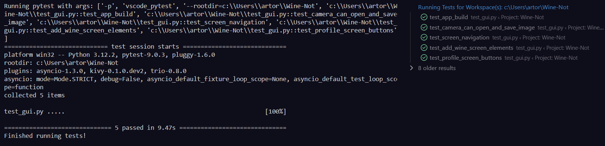

# Wine-Not-
A mobile app written in Python. Upload a picture of a wine bottle or a whole wine list to get tailored suggestions. Keep track of which wines you liked and did not like

## Required libraries
`pip install opencv-python`

`pip install pandas`

`pip install easyocr`

`pip install kivy`

## How to Run
###### Make sure before you start you have installed the required libraries

`git clone https://github.com/bdiaz4/Wine-Not`

`cd Wine-Not`

`python gui.py`

## Pytests

Required Libaries

`pip install pytest`

`pip install pytest-trio`

`pip install pytest-kivy`

Results of the pytests after running `test_gui.py`

