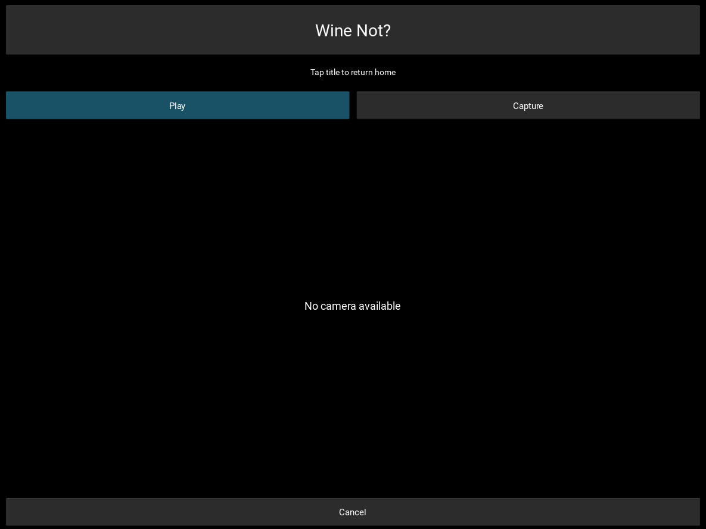

# Home Page

The home page contains four navigation options [My Profile](#my-profile), [Add Wine](#add-wine), [Get Recommendation](#get-recommendation), and [Settings](#settings)

## My Profile

text

### Saved Wines

text

### Favorites

text

### Recently Saved

text

### Edit Profile

text

### My Preferences

text

### User Profile

text

## Add Wine

text

### Upload Picture

text

#### Take New Photo

text

### Add Manually

text

## Get Recommendation

text

### Upload Menu

text

### Chat Assistant

text

## Settings

text

### Reset Data

text

### Theme

text
